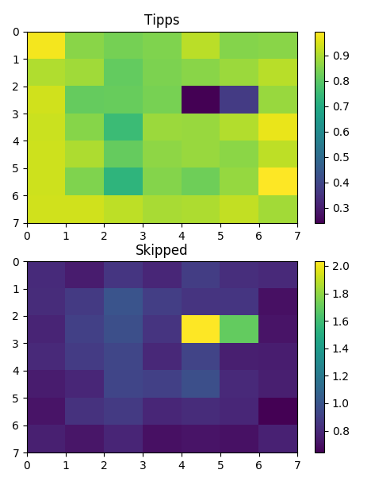
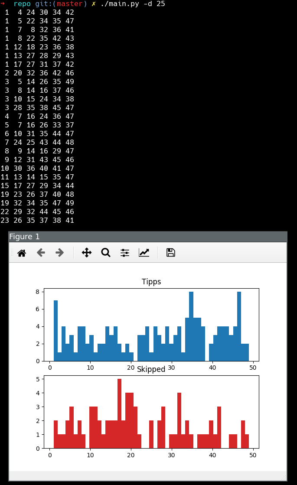
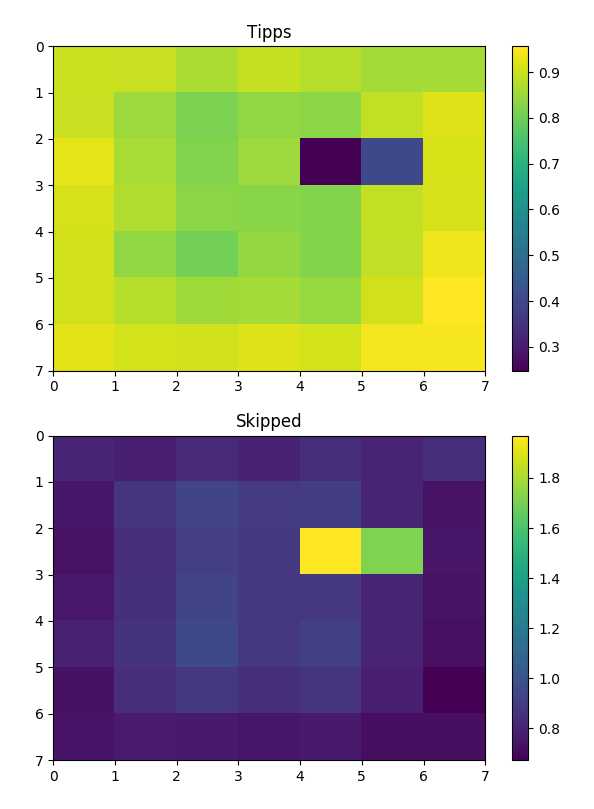
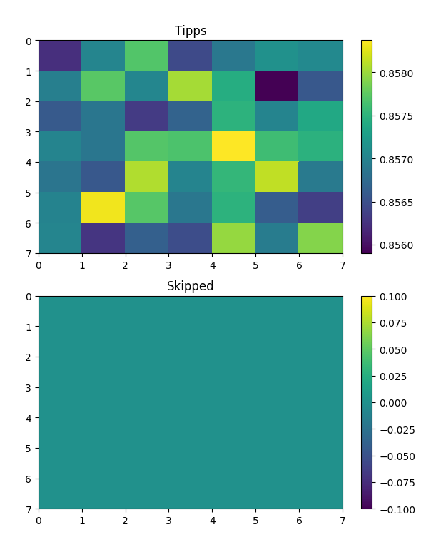
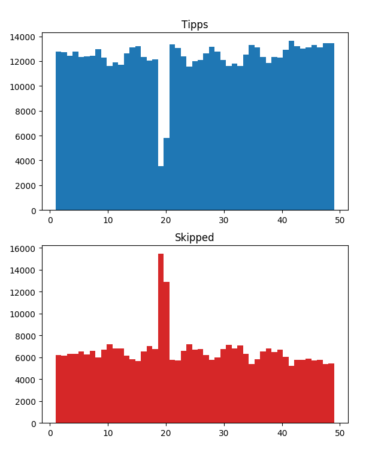

# quicktipp

Quicktipp – get random numbers for 6 of 49 (german lotto) while leaving out common patterns

# requirements

- matplotlib
- numpy
- functools
- unittest

# usage

```
./main.py -h
usage: main.py [-h] [-v VERBOSE] [-t] [-f] [-b] [-j] [-2] [-d] NUMBERS

Generate good(TM) lotto numbers.

positional arguments:
  NUMBERS               The amount of numbers you want

optional arguments:
  -h, --help            show this help message and exit
  -v VERBOSE, --verbose VERBOSE
                        Chattyness
  -t, --test            Tests the distribution of n generated and filtered
                        results, use e.g. 10000
  -f, --find            Search for the given numbers in the journal four or
                        more matches, comma separated, no spaces as NUMBERS
                        parameter
  -b, --no-blacklist    Ignores the blacklist, kind of useless except for
                        testing
  -j, --no-journal      Does not write to journal ~/.quicktipp.log in this run
                        (also does not in -t or -d)
  -2, --two-dee         Print distribution histogramm as 2D map of the number
                        coordinates
  -d, --dist            Shows the distribution of the normally generated and
                        displayed results
```

## Simply get some tips

```
./main.py 3
 1  6 24 29 30 34
 2  6 23 32 44 47
 5  6  8 17 21 35
```

## Get more details about the tips

```
./main.py -v 2 1
Skipped (1)
Skipped because blacklist pattern:
    name: corners misses: 1
    x.....x
    .......
    .......
    .......
    .......
    .......
    x.....x


Numbers:
     1  .  .  .  5  .  7 
     .  . 10  .  .  .  . 
     .  .  .  .  .  .  . 
     .  .  .  .  .  . 28 
     .  .  .  .  .  .  . 
     .  .  .  .  .  .  . 
    43  .  .  .  .  .  . 

Tipps (1)
#1
 .  2  .  .  .  .  . 
 8  .  .  .  .  .  . 
 . 16  .  .  .  .  . 
 .  .  .  .  .  .  . 
 .  . 31 32  .  .  . 
 .  .  .  .  .  . 42 
 .  .  .  .  .  .  . 

```

_We can see one tip was skipped because of the 'corners' blacklist entry._

## Find a previous tip in the journal

```
./main.py -f 2,8,16,31,32,42
2019-07-18T23:09:57.353923: tipp     2  8 16 31 32 42 (6 matches)
```

_When you want to know if you could have won._

## Show the number distribution

```
./main.py -2 -t 5000
```



_Distribution is not equal due to blacklist entries. The date blacklist entry having the most impact. Use -b to skip the blacklist. Leave -2 to get a boring bar chart._
l
_Is slow for big numbers. Pattern matching is not implemented efficiently and not parallelized ... let's say was not so successfull using python, given my basic python skills. Not important for daily use anyway._

## Show drawn numbers distribution

```
./main.py -d 25
```



# distribution

## 100k samples with blacklist



## 10m samples without blacklist



## 100k samples bar chart



## run tests

```
ls -1 *_test.py | xargs -n1 /usr/bin/python3
```

I usually use it with a file watcher like [reflex](https://github.com/cespare/reflex).

```
reflex -r '\.py$' -- bash -c "printf '/%.0s' {1..70}; echo -e '\\n\\n\\n\\n'; ls -1 *_test.py | xargs -n1 python3"
```

# notes

I was interested in and experimented with shuffling algorithms (fisher-yates and sattolo ([https://en.wikipedia.org/wiki/Fisher%E2%80%93Yates_shuffle](https://en.wikipedia.org/wiki/Fisher%E2%80%93Yates_shuffle)) and additionally tried playing lotto, 6 of 49. Then I found out it was good to bet numbers nobody else does. Your chances are not increasing but in case you do win, you will get more money.

So I wrote a little tool to prevent me from using common patterns or numbers since the lotto algorithm just does a simple shuffle.

Good luck. If you win - cut me in. :-)

# LICENSE

GPL v3
